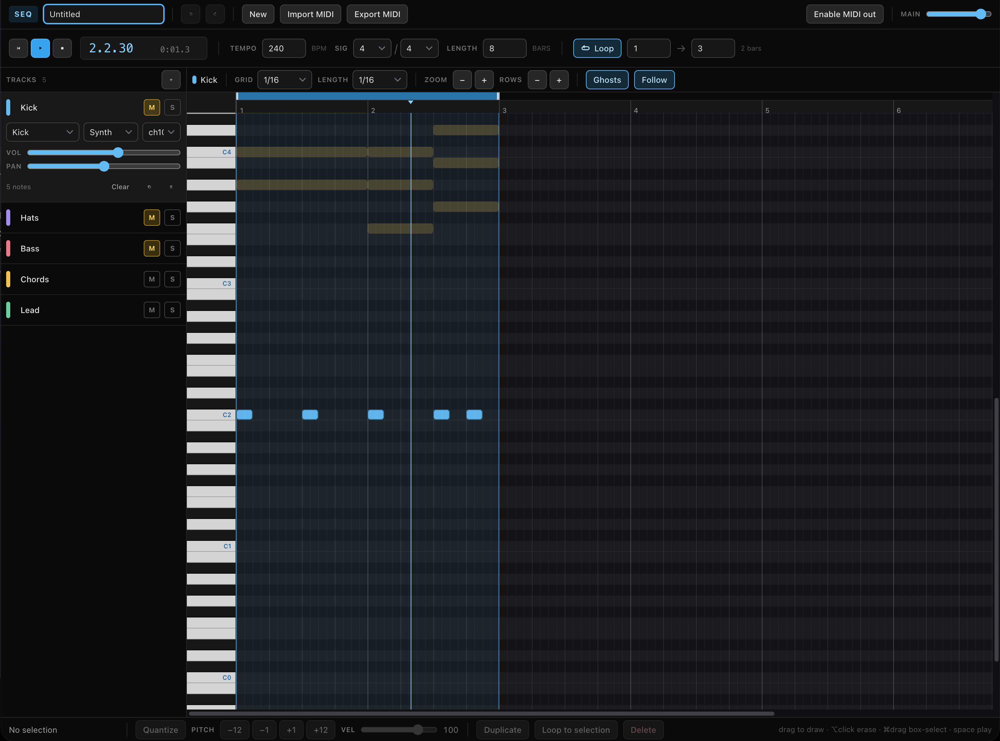

# Sequencer

A browser MIDI sequencer. Draw notes on a timeline, loop any region, and play
them through a built-in synth or out to hardware over Web MIDI.

```bash
pnpm install
pnpm dev      # http://localhost:3000
```



Everything runs client-side; there is no server, database, or account. The
current project autosaves to `localStorage` and reloads on your next visit.

## What it does

- **Multi-track timeline.** Any number of tracks, each with its own instrument,
  volume, pan, mute/solo, and MIDI channel.
- **Piano-roll editing.** Draw, drag, stretch, transpose, quantize, and
  velocity-edit notes on a snapping grid (1/1 down to 1/32, including triplets).
- **Looping.** Drag a region in the loop lane; playback wraps seamlessly at the
  loop end, and edits you make while it is running take effect on the next pass.
- **Built-in synth.** Eight subtractive patches (pads, leads, bass, plucks,
  bells, organ, noise percussion, kick) built from oscillators, an ADSR, a
  filter envelope, and a pitch sweep. No samples to load.
- **Web MIDI out.** Send any track to an external instrument on a chosen
  channel, with sample-accurate timestamps. Tracks can play the internal synth,
  external MIDI, or both.
- **Standard MIDI File import and export**, so projects move in and out of a DAW.
- **Undo/redo** across note and track edits.

## Keyboard

| Key | Action |
| --- | --- |
| `Space` | Play / pause |
| `Enter` | Stop and rewind to where playback started |
| `⌘Z` / `⇧⌘Z` | Undo / redo |
| `⌘A` | Select every note on the current track |
| `⌘D` | Duplicate the selection after itself |
| `Delete` | Delete the selection |
| `←` / `→` | Nudge by one grid step (`⇧` for a bar) |
| `↑` / `↓` | Transpose a semitone (`⇧` for an octave) |
| `Q` | Quantize the selection to the grid |
| `L` | Toggle looping |
| `Esc` | Clear the selection |

In the piano roll: drag empty space to draw a note, drag its right edge to
change length, `⌥`-click or right-click to erase, `⌘`-drag to box-select,
`⇧`-click to add to the selection. Click a piano key to audition it.

## How the timing works

Note timing never depends on React, `setTimeout`, or frame rate. The transport
(`lib/audio/engine.ts`) runs a **lookahead scheduler**: every 40 ms it walks
forward through musical time and writes each upcoming note onto the Web Audio
clock with an exact start time, staying ~200 ms ahead of the playhead. Envelopes,
filter sweeps, and note-offs are all scheduled up front, so a busy main thread
can stutter the UI without ever affecting what you hear.

Because the audio clock — not a timer — is the source of truth, the playhead is
*derived* rather than counted. Each scheduling pass records the span of ticks it
covered and the audio time it covers, and `getPositionTick()` maps the current
audio time back onto a musical position through those spans. That is what keeps
the playhead honest across loop wraps: the wrap is just the point where one span
ends at the loop end and the next begins at the loop start.

When the tab is hidden, browsers throttle timers to about one second, which would
starve the queue, so the lookahead widens to 2.5 s until the tab is visible again.

`nextScanWindow()` in `lib/audio/transportMath.ts` holds the loop rules as a pure
function — clamping a window to the loop end, wrapping back to the start, cutting
held notes at the boundary so they cannot bleed over their own retrigger, and
letting playback that *starts* after the loop end run on to the end of the song
instead of being yanked backwards. It is unit-tested directly.

## Layout

```
app/                 Next.js App Router entry (one static page)
components/          UI: transport, track panel, piano-roll editor, status bar
lib/
  audio/engine.ts    Transport: lookahead scheduler, mixer, position reporting
  audio/synth.ts     One-shot voice scheduling (ADSR, filter, pitch sweep)
  audio/transportMath.ts  Pure loop/window arithmetic
  midi/output.ts     Web MIDI port selection and timestamped sends
  midi/file.ts       Standard MIDI File reader and writer
  store.ts           Zustand document store, undo history, autosave
  music.ts           Tick/bar/beat conversions, pitch naming, snapping
  project.ts         Project and track factories, validation of loaded JSON
test/                Node test-runner suites for the loop math and MIDI files
```

## Checks

```bash
pnpm test         # loop-window math and MIDI file round-trips
pnpm lint
pnpm build
```

## Notes and limits

- One tempo and one time signature per project — there is no tempo map. An
  imported file's first tempo event wins.
- Playback resumes only notes that *start* at or after the playhead, so a note
  already sounding when you hit play is not retriggered mid-way.
- Web MIDI needs a Chromium-based browser; the internal synth works everywhere
  Web Audio does.
- Audio starts on your first interaction with the transport, as browsers require.

## Dreaming
Thanks to Chris Gambill for the [`/dreaming`](https://github.com/cg1262/dreaming-skill) skill that wrote the consolidated notes on the sequencer.
